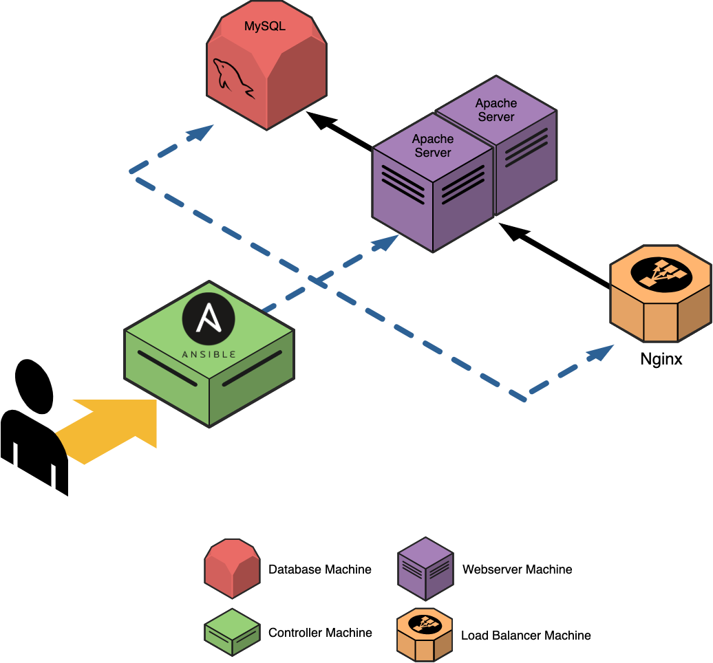
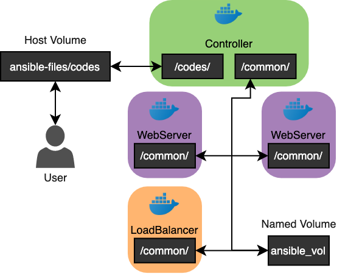

# Ansible Lab Repo
This is a repo where you can create an ansible lab setup and start learning ansible.
This setup helps to create a docker environment where you can setup ansible and start learning ansible.
Using docker as an option for learning ansible is better since it is light-weight solution compared to having VMs and can be easily created. Also, in case if you make a mistake you can easily create your environment using the `docker-compose` file.


# Ansible Lab Setup:
There are three types of **working** hosts and one **controller** host in this project. Feel free to change them as you wish. the roles in this setup is as follows:

1. **Loadbalancer (1x)**: A sing host running Nginx as loadbalancer
2. **Web-Server (2x)**: 2 hosts running Apache as the web server
3. **Database (1x)**: Database host running MysqlDB
4. **Controller (1x)**: Controller host that runs Ansible and automates the configuration of above-mentioned nodes

**NOTE**: checkout the `docker-compose.yml` file to change the number of each machine. The current version of the docker-compose file creates the environment below: 



### Volumes:
There are two docker volumes in this setup, one of them is a `named volume` and the other one is `host volume`:

- The first one (`named volume`) is named `ansible_vol` in the `docker-compose` file and is used to share files (in this case ssh-keys that are created by the `controller`) among hosts. These files will be used in the `run.sh` script.

- The second one is a `host volume` which is bind mounts  `ansible-files` to `/code` in the controller so whatever script you create or modify in `ansible-files/codes/` can be easilty accessed from within the `controller`

Here is a diagram of how the volume setup is:


## Setup Environment:
1. Clone the repo
    ```bash
    git clone https://github.com/BeardedDonut/ansible-lab
    ```
2. Navigate to the `hosts-docker` directory
    ```bash
    cd hosts-docker
    ```
3. Change the `docker-compose` file, according to your prefered setup
4. Deploy the setup
    ```bash
    docker-compose up -d --build
    ```
5. Connect to the `controller` node
    ```bash
    docker container exec -it controller bash
    ```
6. Run zsh
    ```bash
    # OPTIONAL: you can also change the zsh theme if you like by modify ~/.zshrc
    # I personally changed the theme to "alanpeabody"
    zsh # this might take a few seconds to run
    ```
7. Go to `/codes/` directory and run the commands below (**Note**: this directory is share with your host)
    ```bash
    cd /codes/

    # start ssh agent
    ssh-agent zsh

    # add master key to ssh agent
    ssh-add /common/master_key

    # NOTE: you will be prompted for entering passphrase it 12345
    ```
8. ping all the hosts
    ```bash
    ansible -m ping all

    # NOTE: You will receive this message:
    ECDSA key fingerprint is ECDSA key fingerprint is SHA256:ywVL4dyWYdwCipVSqmYzIZPlUA0Q85AaMVe4IbI9ca.
    Are you sure you want to continue connecting (yes/no)?
    # Type "yes" and hit enter, do this four times,
    ```
9. Redo step 8 and you should see something like this:
    ```bash
    control | SUCCESS => {
    "changed": false, 
    "ping": "pong"
    }
    lb01 | SUCCESS => {
        "changed": false, 
        "ping": "pong"
    }
    web01 | SUCCESS => {
        "changed": false, 
        "ping": "pong"
    }
    db01 | SUCCESS => {
        "changed": false, 
        "ping": "pong"
    }
    web02 | SUCCESS => {
        "changed": false, 
        "ping": "pong"
    }
    ```

# Inside ansible-files Directory:
the `ansible-files` directory contains all the required playbooks,templates and the demo flask application files. The `codes` directory will be bind mounted to the `controller` host and is accessible from `/codes` directory inside host. 
Ther reason behind this is that if you can edit/update the files on your own environment (not `controller`) and have them updated inside the `controller` as well. A brief description of what each directory contains is in the following:

1. **ansible-files/codes/demo**: demo flask application files and configurations
2. **ansible-files/codes/service-playbooks**: Ansible playbooks to setup each host
3. **ansible-files/codes/templates**: Templates that are used for setting up this environment
4. **ansible-files/codes/utility-playbooks**: Ansible playbooks that usually used against the entire stack and are usually for troubleshooting and stack monitoring.

---

***Note***: 
I used [this](https://github.com/LMtx/ansible-lab-docker) repo to create the setup and it was really helpful:


